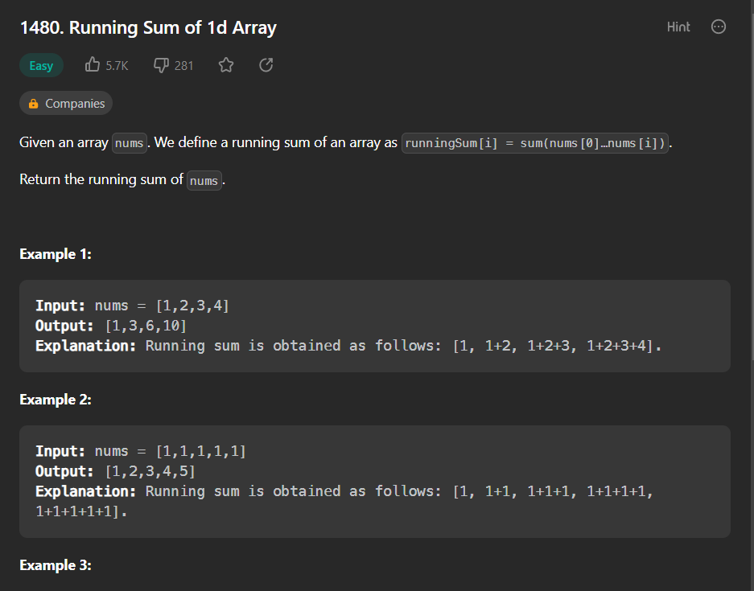
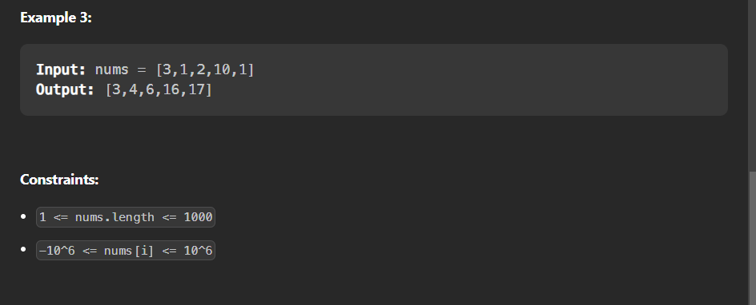

- question link : https://leetcode.com/problems/running-sum-of-1d-array




- question :
    ```
    class Solution:
        def runningSum(self, nums: List[int]) -> List[int]:
    ```

- solution :
    ```
    class Solution:
    def runningSum(self, nums: List[int]) -> List[int]:
        sum_list=[]
        sum_list.append(nums[0])
        for i in range(len(nums)-1):
            sum_list.append(sum_list[-1]+nums[i+1])
        return sum_list
    ```