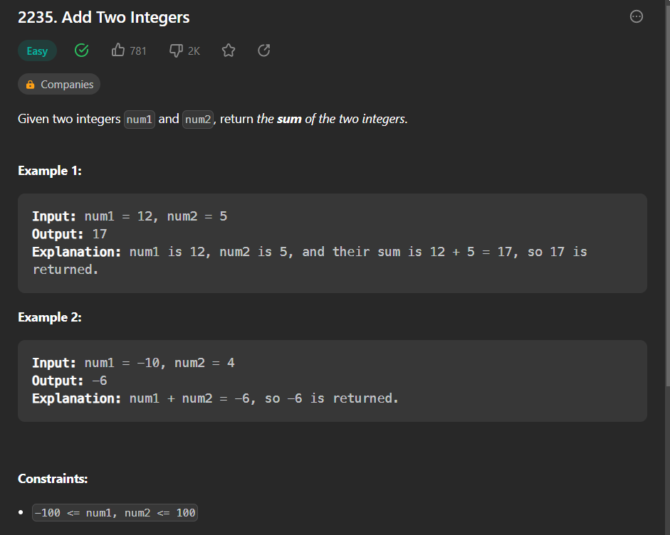

- link to question : https://leetcode.com/problems/add-two-integers/

- 

- question:
    ```
    class Solution:
    def sum(self, num1: int, num2: int) -> int:
    ```
- Solution:
    ```
    class Solution:
    def sum(self, num1: int, num2: int) -> int:
        return num1+num2
    ```