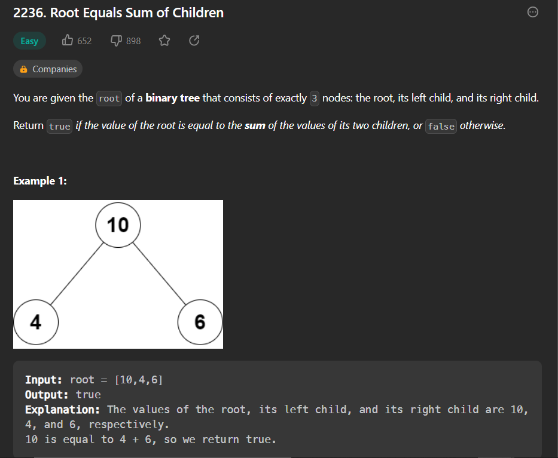
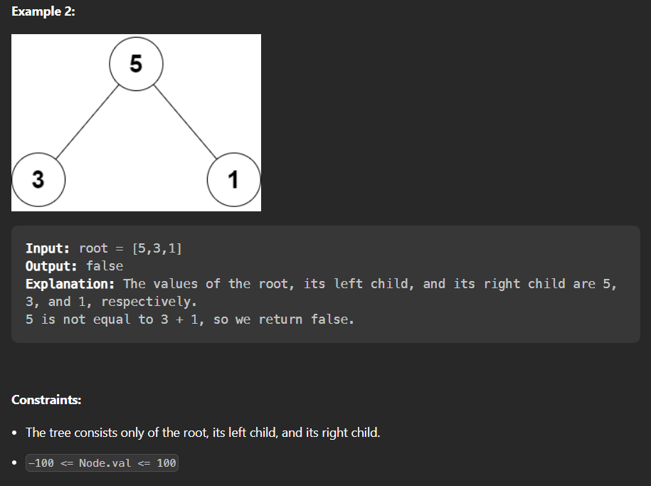

- question link : https://leetcode.com/problems/root-equals-sum-of-children/description/




- question 
    ```
    # Definition for a binary tree node.
    # class TreeNode:
    #     def __init__(self, val=0, left=None, right=None):
    #         self.val = val
    #         self.left = left
    #         self.right = right
    class Solution:
        def checkTree(self, root: Optional[TreeNode]) -> bool:
    ```
    - solution
    ```
    # Definition for a binary tree node.
    # class TreeNode:
    #     def __init__(self, val=0, left=None, right=None):
    #         self.val = val
    #         self.left = left
    #         self.right = right
    class Solution:
        def checkTree(self, root: Optional[TreeNode]) -> bool:
            
            return root.left.val+root.right.val==root.val
    ```