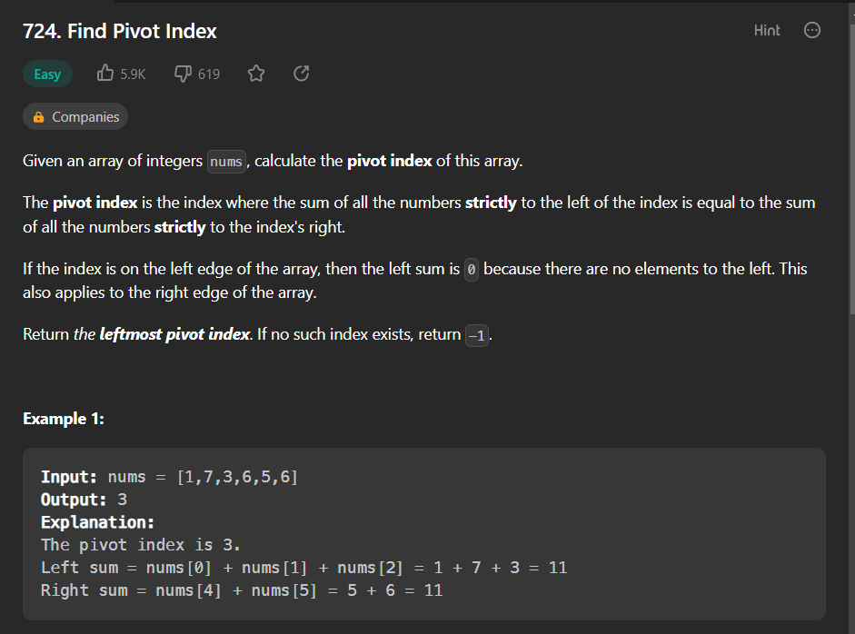
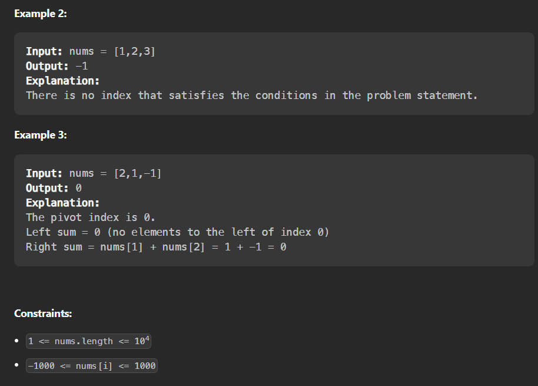

- question link : https://leetcode.com/problems/find-pivot-index/description/




- question :
    ```
    class Solution:
    def pivotIndex(self, nums: List[int]) -> int:
    ```

- solution:
    - easy solution:
    ```
    class Solution:
    def pivotIndex(self, nums: List[int]) -> int:
        for i in range(len(nums)):
            if sum(nums[:i])==sum(nums[i+1:]):
                return i
        return -1
    ```
    - note : this solution passes
    
    - we have to comeup with a different logic and solution
    - they want to reduce the complexity to O(N)
    - official solution:
    ```
    class Solution(object):
    def pivotIndex(self, nums):
        S = sum(nums)
        leftsum = 0
        for i, x in enumerate(nums):
            if leftsum == (S - leftsum - x):
                return i
            leftsum += x
        return -1
    ```
    - lets  give video explanation for this solution
